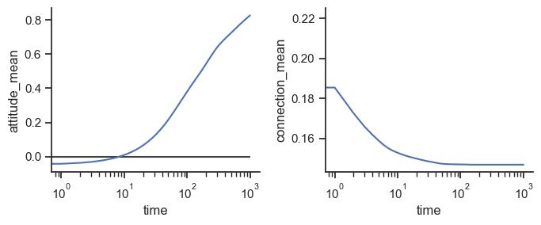
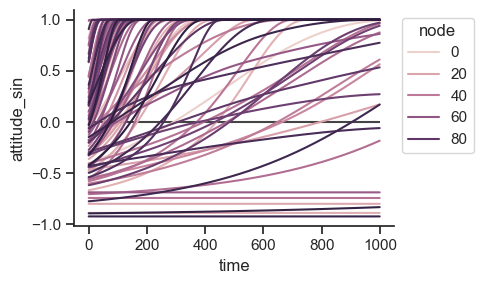

# Getting started

This page is an example of how to use the network echos modeling framework.

## Importing network-echos

Start by importing the model's classes, and matplotlib for plotting support later on.

```py
>>> import matplotlib.pyplot as plt
>>> from netechos.core import NetworkModel
>>> from netechos.plot import NetworkPlot
```

## Initializing a model

With the modules imported, you can access all of the model's functionality. To run a model, invoke `NetworkModel` from the `netechos.core` module to create an instance of the model object. The object will store all the data and serve as the model interface.

```py
>>> nemodel = NetworkModel(number_of_nodes=100, interaction_type="symmetric")
```
With the model object instantiated as `nemodel`, you can use its attached methods to perform operations. For example, if you wanted to simulate with an Erdős-Rényi random network as your basis, you could initialize the starting network for that like so:

```py
>>> nemodel.create_network(network_type="erdos_renyi", p=0.3)
```

Simulations also depend on the individual attitudes of the in the basis network and the connections between them, which you can initalize like so:

```py
>>> nemodel.initialize_connections()
>>> nemodel.initialize_attitudes()
```

The `initialize_connections()` and `initialize_attitudes()` methods each include several optional arguments you can specify to customize how the initial connections and attitudes are assigned.

## Running a simulation

With the basis network, connections, and attitudes all initialized on the model object, you can now run a simulation.

```py
>>> nemodel.run_simulation(tmax=1000)
```

Once the simulation is complete, the model object can be passed to `NetworkPlot` from the `netechos.plot` module to see how the simulation went. This module allows quick access to simple aspects of the simulation results.

## Reviewing a simulation

```py
>>> neplot = NetworkPlot(nemodel)
```

You can examine how the mean node attitudes and mean connection strength evolved over time:

```py
>>> means_over_time = neplot.attitude_and_connection_means()
>>> plt.show()
```



And you can view how each individual node's attitude evolved over time:

```py
>>> attitudes_over_time = neplot.node_attitudes_over_time()
>>> plt.show()
```



For large networks, e.g., 1000+ nodes, this individual node plot will be slow and unhelpful, but it can be used with a smaller network to give an illustrative example to pair with the plot of the means earlier.
